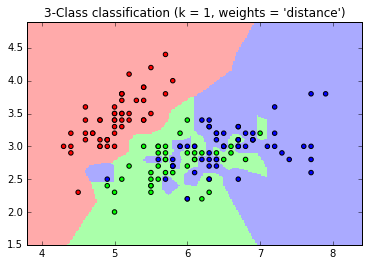
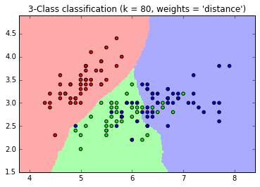
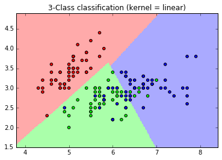
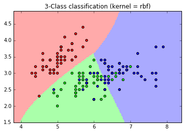
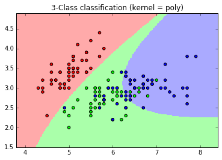

# Workshop - Answers (agarg12)
## Effects of K

At very low K, we get a lot of "islands" in our prediction plot. At low K, the model tries to fit every possible training data point correctly by using just single nearest neighbor.  
Because of this, the model overfits on the training set and tries to learn even the anomalies/errors/noise present in the training data set.

At very large K, the model uses a large number of data points for predicting class label of each data point. This causes the model to undertrain as small groups of same class data points may be misclassified as it ends up taking into account even the far away data points.

## How to select Best K

### Generating Plots
One Way can be to generate plots for each K and try to find one which provides a 'decent' split between the classes.
This may not be possible for large datasets.

### Using Cross Validation:
Using cross validation, we can try various K and see how weel various values of K generalizes over the unseen data.
Based on the accuracies for different K, we can choose a proper value of K.

## Experimenting with SVM Kernels

Linear Kernel  

RBF Kernel  

Poly Kernel  

## Deciding kernel for SVM

One way would be run cross validation over large data sets to decide which kernel works best and generalizes well.
 

Another way would be to generate plots for datasets for different kernels and decide the kernel which provides most generalized fit over test data. 