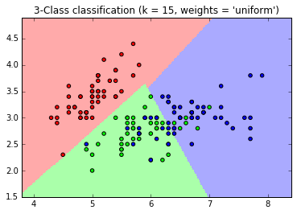
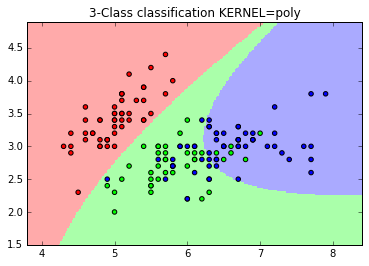

### Experiment with different values of K

k value ranges between 1 to 10

k = 1
k_1.png, k_1_distance.png

k = 9
k_9.png, k_9_uniform.png

### Choosing best K:

Should be done using cross-validation on a metric of choice like accuracy score, precision, recall, or f1

### Explore different kernels of support vector machine

Kernel = linear

Kernel = rbf

Kernel = polynomial

