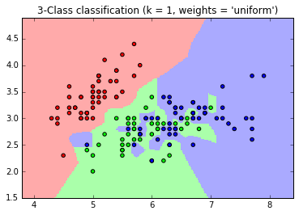
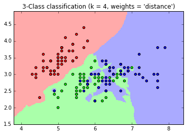
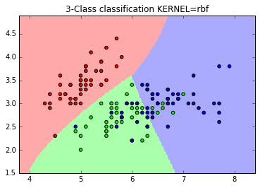
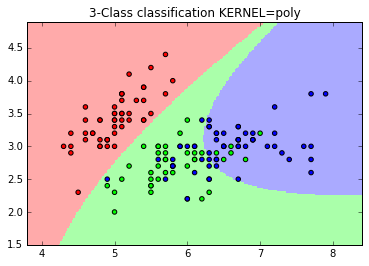
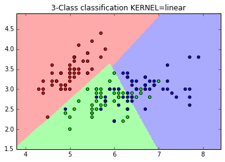
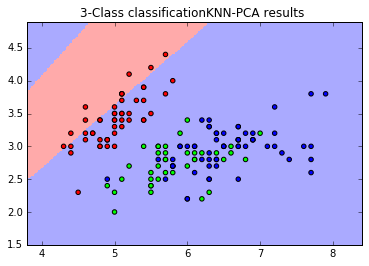
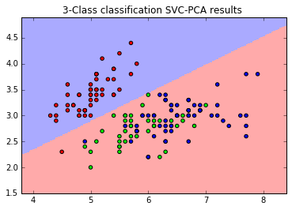

# Workshop - Answers (agarg12)

### Experiments with different values of K:

The plots in the experiments show that lower values of k create separated boundaries. This can represent overfitting case. Too high values add a lot of bias.

K=1

K=4

### Choosing best K:

Should be done using cross-validation on a metric of choice like accuracy score, precision, recall, or f1

### Explore different kernels of Support Vector Machine:

Different kernels like rbf, linear, poly create different decision boundries for the classification

Kernel = rbf

Kernel = polynomial

Kernel = linear

### Explian how we should choose the kernel.

Should be done using cross-validation on a metric of choice by fitting different models with different kernels and choose the best one

## Bonus Part

### PCA for dimensionality reduction

We perform PCA using scikit learn's PCA function and then choose enough number of components to cover 97% of the variance in the data

Below are the resultant visualizations after performing PCA and then training:

1. KNN

2. SVC

